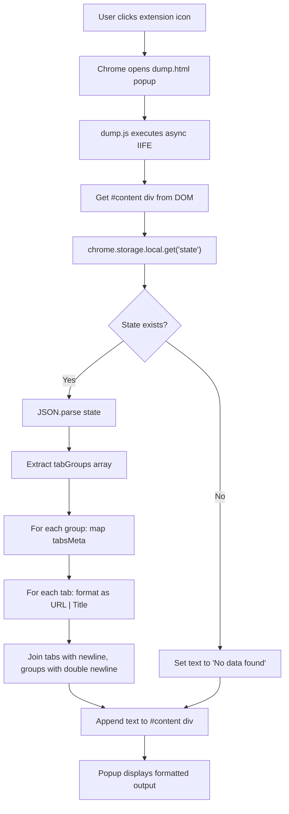

# Data Dump

A lightweight Chrome Extension (Manifest V3) that reads tab group data from Chrome's local storage and displays it in a human-readable format. Built as a companion utility for [OneTab](https://www.one-tab.com/) — it extracts the stored tab metadata and presents each tab as a `URL | Title` pair, grouped by tab group.

## Features

- Reads OneTab's stored state from `chrome.storage.local`
- Parses and formats tab groups into readable text
- Displays output in a minimal popup on extension icon click
- Zero external dependencies

## Files

| File | Purpose |
|---|---|
| `manifest.json` | Chrome Extension configuration (Manifest V3), declares `storage` permission and popup |
| `dump.html` | Popup UI — a single `<div>` with pre-formatted whitespace styling |
| `dump.js` | Core logic — fetches, parses, and renders tab data |

## How It Works

1. User clicks the extension icon in the Chrome toolbar
2. Chrome opens `dump.html` as the popup
3. `dump.js` runs and fetches the `state` key from `chrome.storage.local`
4. The JSON state is parsed, extracting `tabGroups` and their `tabsMeta` arrays
5. Each tab is formatted as `URL | Title`, groups are separated by blank lines
6. The formatted text is rendered into the popup

## Code Flow



## Expected Data Structure

The extension expects `chrome.storage.local` to contain a `state` key with JSON in this shape:

```json
{
  "tabGroups": [
    {
      "tabsMeta": [
        { "url": "https://example.com", "title": "Example Page" },
        { "url": "https://example.com/other", "title": "Another Page" }
      ]
    }
  ]
}
```

## Usage

This extension is a recovery tool for when OneTab no longer runs due to an outdated browser that cannot be updated. For full details, see the [OneTab Tab Recovery Guide](https://www.one-tab.com/tab-recovery).

> **Warning:** Do not attempt to uninstall and re-install OneTab. This will cause data loss.

1. First, try updating Chrome via **Menu > Help > About Google Chrome**. Only proceed if your browser cannot be updated.
2. Download and extract [`datadump-v2.0.zip`](https://github.com/livingston/onetab-datadump/releases/latest/download/datadump-v2.0.zip), note the extraction location
3. Navigate to `chrome://extensions/` in your browser
4. Enable **Developer mode** via the toggle in the top-right corner
5. **Disable OneTab** using its toggle switch (do not remove it)
6. Click **Load unpacked** and select the extracted datadump directory
7. A **"D"** icon appears in the toolbar — click it to view your stored tabs
8. Copy the tab list and import it into OneTab on another device using OneTab's **Import/Export** feature
9. Disable **Developer mode** when finished

Note: Manifest deprecation warnings during this process are normal.
